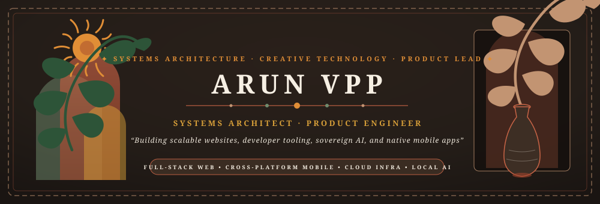
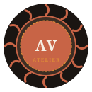

 

  
  
  

### 🏺 🌾 I. THE ATELIER MANIFESTO &amp; NOMADIC ROOTS 🌾 🏺

> *“I'm a Systems Architect and Creative Technologist who genuinely loves building things from the ground up. Whether I'm tweaking backend infrastructure for maximum performance or obsessing over the mathematical precision of a frontend animation, I enjoy getting my hands dirty and pushing the limits of what the web can do.”*

 

> *“Applying to **Hacker House Goa 2026** because the ‘ship or ship’ philosophy is how I craft — 4 days of heads-down coding, collaborating with passionate creators, and shaping software of organic beauty and enduring integrity right by the Arabian Sea without hackathon fluff.”*

<b>ARUN VPP</b> &#160;•&#160; SYSTEMS ARCHITECT &amp; CREATIVE TECHNOLOGIST &#160;•&#160; ATELIER BOHÈME

### 🌿 ☀️ II. THE WORKSHOP &amp; NATURAL ELEMENTS (RAW MATERIALS)

<b>🪵 HARDWOOD &amp; ANVIL (CORE RUNTIMES &amp; SYSTEMS)</b>

  
  
  
  
  
  

<b>🌾 THE GLOBAL LOOM &amp; FABRIC (CLOUD &amp; INFRASTRUCTURE)</b>

  
  
  
  

<b>🏺 CLAY &amp; KILN (DATA LAYER &amp; STREAMING)</b>

  
  
  

<b>🎨 PIGMENTS, LINOCUT &amp; SHADERS (CREATIVE &amp; FRONTEND)</b>

  
  
  

<i>To architect and craft at high velocity, AI coding assistants — <b>Claude</b>, <b>Antigravity</b>, and <b>Codex</b> — are wielded as intuitive guild companions.</i>

### 🌻 ☀️ III. THE EXHIBITION CATALOG — HANDCRAFTED ARTIFACTS ☀️ 🌻

FEATURING PINNED REPOSITORIES &amp; PUBLIC FORGES FROM <a href="https://github.com/Cherie05">@Cherie05</a>

 

<table>
  <!-- ROW 1: PINNED REPOSITORIES -->
  <tr>
    <td width="50%" valign="top">
      <h3>🏺 LOT 01 · <a href="https://github.com/Cherie05/interflect">interflect</a> 📌</h3>
      
<b>STATUS</b> ACTIVE &#160;•&#160; <b>MEDIUM</b> Rust &#160;•&#160; <b>ORIGIN</b> Deterministic Graphics

      
<i>A renderer that doesn't sample. It solves. Noise-free CPU global illumination — no Monte Carlo stochastic noise, no AI denoiser, no GPU dependency.</i>

    </td>
    <td width="50%" valign="top">
      <h3>🏺 LOT 02 · <a href="https://github.com/Cherie05/nirvaha-ai">nirvaha-ai</a> 📌</h3>
      
<b>STATUS</b> ACTIVE &#160;•&#160; <b>MEDIUM</b> TypeScript &#160;•&#160; <b>ORIGIN</b> Circular Recycling

      
<i>An AI-powered plastic waste classification &amp; neighborhood B2B logistics aggregation platform engineered for circular community recycling.</i>

    </td>
  </tr>
  <!-- ROW 2: PINNED REPOSITORIES -->
  <tr>
    <td width="50%" valign="top">
      <h3>🏺 LOT 03 · <a href="https://github.com/Cherie05/The-Vespers">The-Vespers</a> 📌</h3>
      
<b>STATUS</b> BETA &#160;•&#160; <b>MEDIUM</b> Rust / C++ / eBPF &#160;•&#160; <b>ORIGIN</b> Google Hackathon (Track 2)

      
<i>Federated environmental forensic &amp; transboundary smoke plume dispersion platform powered by Gemini Vision AI, Gaussian physics, and NASA FIRMS satellite telemetry.</i>

    </td>
    <td width="50%" valign="top">
      <h3>🏺 LOT 04 · <a href="https://github.com/Cherie05/flowchartmaker">flowchartmaker</a> 📌</h3>
      
<b>STATUS</b> ACTIVE &#160;•&#160; <b>MEDIUM</b> TypeScript &#160;•&#160; <b>ORIGIN</b> OpenAI Build Week

      
<i>An intuitive, local-first flowchart editor built for lightning-fast architecture diagrams, powered by OpenAI structured outputs.</i>

    </td>
  </tr>
  <!-- ROW 3: PINNED + FEATURED PUBLIC -->
  <tr>
    <td width="50%" valign="top">
      <h3>🏺 LOT 05 · <a href="https://github.com/Cherie05/blunote">blunote</a> 📌</h3>
      
<b>STATUS</b> ACTIVE &#160;•&#160; <b>MEDIUM</b> TypeScript / Expo &#160;•&#160; <b>ORIGIN</b> Private Offline-First

      
<i>An offline-first personal hydration tracker built with Expo and SQLite. Zero accounts, zero external servers, private and sovereign by design.</i>

    </td>
    <td width="50%" valign="top">
      <h3>🏺 LOT 06 · <a href="https://wizzleflow.xyz">Wizzleflow</a></h3>
      
<b>STATUS</b> ACTIVE &#160;•&#160; <b>MEDIUM</b> TypeScript / Next.js &#160;•&#160; <b>ORIGIN</b> Codex Hackathon

      
<i>An autonomous, node-based visual workflow loom weaving complex LLM interactions into accessible generative tooling for creators.</i>

    </td>
  </tr>
  <!-- ROW 4: FEATURED PUBLIC REPOSITORIES -->
  <tr>
    <td width="50%" valign="top">
      <h3>🏺 LOT 07 · <a href="https://github.com/Cherie05/hateble">hateble</a></h3>
      
<b>STATUS</b> ACTIVE &#160;•&#160; <b>MEDIUM</b> React / Node.js / Prisma &#160;•&#160; <b>ORIGIN</b> Local Lovable Lite

      
<i>A sovereign, self-hosted web forge leveraging local LLMs via Ollama to autonomously shape, build, and iterate full-stack web applications.</i>

    </td>
    <td width="50%" valign="top">
      <h3>🏺 LOT 08 · <a href="https://github.com/Cherie05/agent-ai">agent-ai</a></h3>
      
<b>STATUS</b> ACTIVE &#160;•&#160; <b>MEDIUM</b> TypeScript / Electron &#160;•&#160; <b>ORIGIN</b> Custom VS Code Fork

      
<i>A heavily modified editor kernel integrating local neural weights into the IDE core to autonomously comprehend codebases and mend compiler defects.</i>

    </td>
  </tr>
  <!-- ROW 5: FEATURED PUBLIC REPOSITORIES -->
  <tr>
    <td width="50%" valign="top">
      <h3>🏺 LOT 09 · <a href="https://github.com/Cherie05/reynox">reynox</a></h3>
      
<b>STATUS</b> ACTIVE &#160;•&#160; <b>MEDIUM</b> Elixir / Phoenix LiveView &#160;•&#160; <b>ORIGIN</b> Distributed Real-Time

      
<i>A resilient authenticated workspace streaming local inference tokens from llama.cpp directly to browser sockets with microsecond concurrency.</i>

    </td>
    <td width="50%" valign="top">
      <h3>🏺 LOT 10 · <a href="https://github.com/Cherie05/ocr">Semantic Doc OCR</a></h3>
      
<b>STATUS</b> ACTIVE &#160;•&#160; <b>MEDIUM</b> React / Vite / ONNX &#160;•&#160; <b>ORIGIN</b> Privacy-First Vision

      
<i>A zero-leakage client-side optical character recognition pipeline executing PP-OCRv5 neural models purely in the local browser memory space.</i>

    </td>
  </tr>
  <!-- ROW 6: FEATURED PUBLIC REPOSITORIES -->
  <tr>
    <td width="50%" valign="top">
      <h3>🏺 LOT 11 · <a href="https://github.com/Cherie05/BarkDSP">BarkDSP</a></h3>
      
<b>STATUS</b> ACTIVE &#160;•&#160; <b>MEDIUM</b> Kotlin / Jetpack Compose / C++ &#160;•&#160; <b>ORIGIN</b> Native Audio Engine

      
<i>A psychoacoustic digital signal processing engine for Android built with native C++ (NDK/Oboe), 10-band parametric EQs, and hardware driver protection.</i>

    </td>
    <td width="50%" valign="top">
      <h3>🏺 LOT 12 · <a href="https://github.com/Cherie05/pocketai">PocketAI</a></h3>
      
<b>STATUS</b> BETA &#160;•&#160; <b>MEDIUM</b> Python / Android NDK &#160;•&#160; <b>ORIGIN</b> Edge Machine Learning

      
<i>An offline-first framework engineered to quantize, run, and fine-tune large conversational weights directly on bare-metal mobile hardware.</i>

    </td>
  </tr>
</table>

### 🌊 🧭 IV. THE NOMADIC BEACON (LIVE TELEMETRY HUD)

  

 

<b>ARTISTIC FREEDOM · EARTHY CHARM · SOULFUL ARCHITECTURE</b>  
Handcrafted with wanderlust and organic care &#160;•&#160; <a href="https://github.com/Cherie05">@Cherie05</a> &#160;•&#160; EST. MMXXVI

